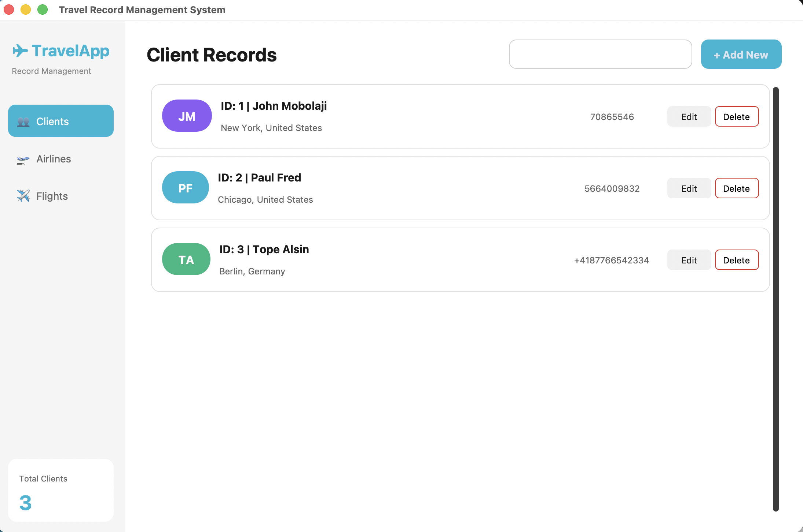
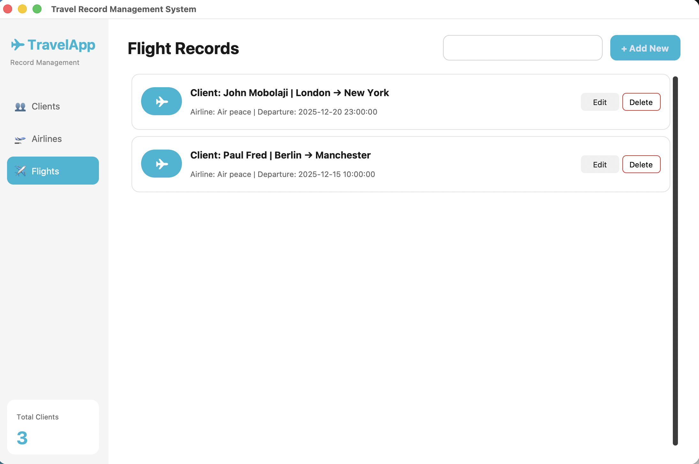
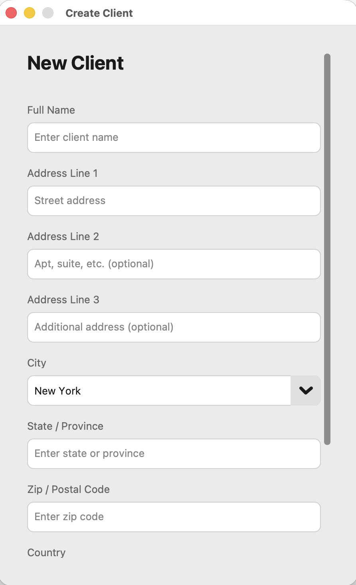
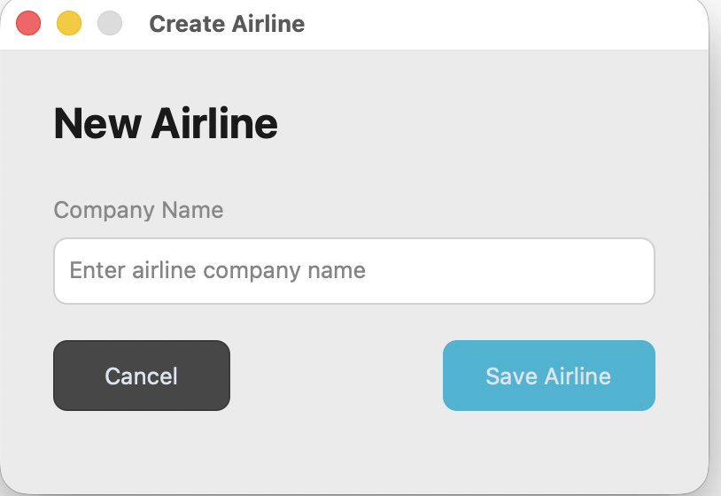
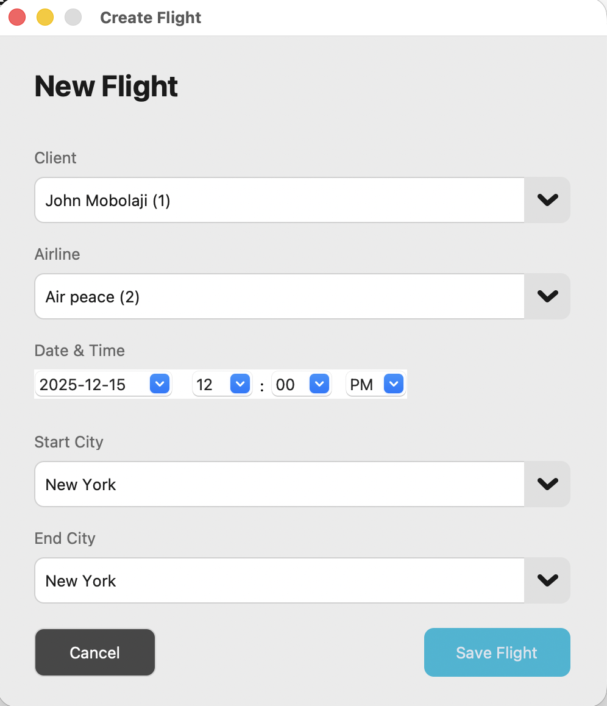
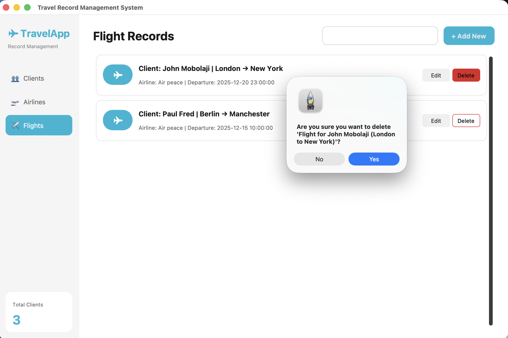
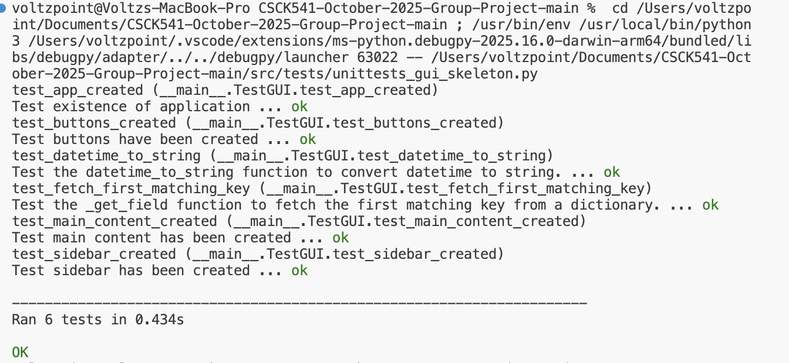
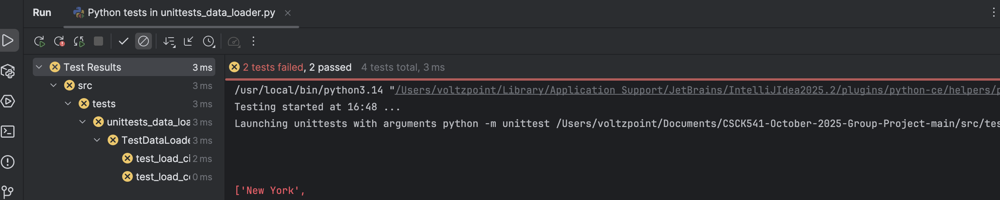
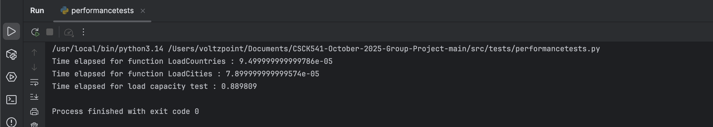

# Travel Record Management System

A modern GUI application built with CustomTkinter for managing travel records including Clients, Airlines, and Flights.

## University Project

**Course:** CSCK541 - Software Development  
**Group:** Group C  
**Institution:** University of Liverpool  
**Term:** 14 December, 2025


## Features

- **Client Management**: Create, read, update, and delete client records
- **Airline Management**: Manage airline company information
- **Flight Management**: Track flights with client-airline relationships, dates, and routes
- **Modern UI**: Clean, card-based interface with real-time search
- **Data Persistence**: Records are saved to JSONL format

---

## Application Screenshots

### Main Interface

#### Client Records View
The main dashboard displaying all client records with search functionality and quick actions.



#### Flight Records View
View and manage flight bookings with client-airline associations and departure details.



#### Search Functionality
Real-time search filtering across all record fields.


---

### Record Creation Dialogs

#### Create New Client
Scrollable form with fields for client details including name, address, city, country, and phone number.



#### Create New Airline
Simple dialog for adding new airline companies.



#### Create New Flight
Flight booking form with client/airline dropdowns, date-time picker, and city selection.



---

### Record Management

#### Delete Confirmation
Confirmation dialog before permanently removing records.



---

## Testing

### Unit Tests

The application includes comprehensive unit tests for all major components.

#### GUI Component Tests
Tests verify the correct creation of application components including sidebar, buttons, and main content areas.



**Test Results:** 6 tests passed in 0.434s ✅

#### Data Loader Tests



### Performance Tests

Performance benchmarks for data loading operations.



| Function | Execution Time |
|----------|----------------|
| LoadCountries | ~0.00009s |
| LoadCities | ~0.00008s |
| Load Capacity Test | ~0.89s |

---

## Prerequisites

- Python 3.8 or higher
- pip (Python package installer)

## Installation Instructions

### Step 1: Clone or Download the Project

If using git:
```bash
git clone <repository-url>
cd CSCK541-October-2025-Group-Project
```

Or simply navigate to the project directory if you already have it.

### Step 2: Create a Virtual Environment (Recommended)

It's recommended to use a virtual environment to avoid conflicts with other Python projects:

**On macOS/Linux:**
```bash
python3 -m venv venv
source venv/bin/activate
```

**On Windows:**
```bash
python -m venv venv
venv\Scripts\activate
```

### Step 3: Install Dependencies

Install all required packages from `requirements.txt`:
```bash
pip install -r requirements.txt
```

This will install:
- `customtkinter` - Modern UI framework
- `tkcalendar` - Date picker widget
- `jsonlines` - JSONL file handling

### Step 4: Verify Installation

Make sure all packages are installed correctly:
```bash
pip list
```

You should see `customtkinter`, `tkcalendar`, and `jsonlines` in the list.

## Running the Application

### Option 1: Run from Project Root (Recommended)

Navigate to the project root directory and run main.py:
```bash
cd /path/to/CSCK541-October-2025-Group-Project && python3 src/main.py
```

For example on macOS/Linux:
```bash
cd ~/CSCK541-October-2025-Group-Project && python3 src/main.py
```

On Windows:
```bash
cd C:\path\to\CSCK541-October-2025-Group-Project && python src/main.py
```

### Option 2: Run GUI Module Directly

From the project root directory:
```bash
python3 src/gui/gui_skeleton.py
```

> **Note:** The application has been tested on IntelliJ IDEA and VS Code and should be run from the project root directory to correctly locate data files.

## Running Tests

### Unit Tests
```bash
python -m pytest src/tests/ -v
```

Or run individual test files:
```bash
python src/tests/unittests_record_manager.py
python src/tests/unittests_data_loader.py
```

### Performance Tests
```bash
python src/tests/performancetests.py
```

## Project Structure
```
CSCK541-October-2025-Group-Project/
├── README.md                 # This file
├── requirements.txt          # Python dependencies
├── .gitignore                # Git ignore rules
├── screenshots/              # Application screenshots
│   ├── client_records.png
│   ├── flight_records.png
│   ├── create_client.png
│   ├── create_airline.png
│   ├── create_flight.png
│   ├── delete_confirmation.png
│   ├── search_records.png
│   ├── unittest_gui.png
│   ├── unittest_data_loader.png
│   └── performance_tests.png
├── src/
│   ├── data/
│   │   ├── cities.csv        # City data
│   │   ├── countries.csv     # Country data
│   │   ├── data_loader.py    # Data loading utilities
│   │   └── test_load_data.py # Data loader tests
│   ├── gui/
│   │   └── gui_skeleton.py   # Main GUI application
│   ├── record/
│   │   ├── record_manager.py # Backend record management
│   │   └── record.jsonl      # Data storage (auto-generated)
│   ├── tests/
│   │   ├── performancetests.py         # Performance test suite
│   │   ├── unittests_data_loader.py    # Unit tests for data loader
│   │   ├── unittests_gui_skeleton.py   # Unit tests for GUI
│   │   └── unittests_record_manager.py # Unit tests for record manager
│   └── main.py               # Application entry point
```

## Usage Guide

### Navigation

- Use the **sidebar** on the left to switch between:
  - Clients
  - Airlines
  - Flights

### Creating Records

1. Click the **"+ Add New"** button in the top right
2. Fill in the required information
3. Click **"Save"** to create the record

### Editing Records

1. Click the **"Edit"** button on any record card
2. Modify the information in the dialog
3. Click **"Save"** to update

### Deleting Records

1. Click the **"Delete"** button on any record card
2. Confirm the deletion in the dialog

### Searching Records

- Type in the **search bar** to filter records in real-time
- The search looks through all fields in the records

## Troubleshooting

### Error: "customtkinter not installed"

**Solution:**
```bash
pip install customtkinter
```

### Error: "tkcalendar not installed"

**Solution:**
```bash
pip install tkcalendar
```

### Error: "ModuleNotFoundError: No module named 'record'"

**Solution:** Make sure you're running from the project root directory, not from inside the `src` folder.

### Error: "FileNotFoundError: cities.csv" or "countries.csv"

**Solution:** Ensure the `src/data/` directory contains `cities.csv` and `countries.csv` files.

### Application Window Doesn't Appear

**Solution:**
- Check that Python 3.8+ is installed: `python3 --version`
- Try running with explicit Python: `python3 src/gui/gui_skeleton.py`
- Check terminal for error messages

### Import Errors

**Solution:** 
- Ensure you're in the project root directory
- Verify all dependencies are installed: `pip install -r requirements.txt`
- Check that Python can find the modules: `python3 -c "import sys; print(sys.path)"`

## System Requirements

- **Operating System**: Windows, macOS, or Linux
- **Python Version**: 3.8 or higher

## Data Format

Records are stored in JSONL format (`record.jsonl`):

- **Client**: ID, Type, Name, Address fields, City, State, Zip Code, Country, Phone Number
- **Airline**: ID, Type, Company Name
- **Flight**: Client_ID, Airline_ID, Date, Start_City, End_City
